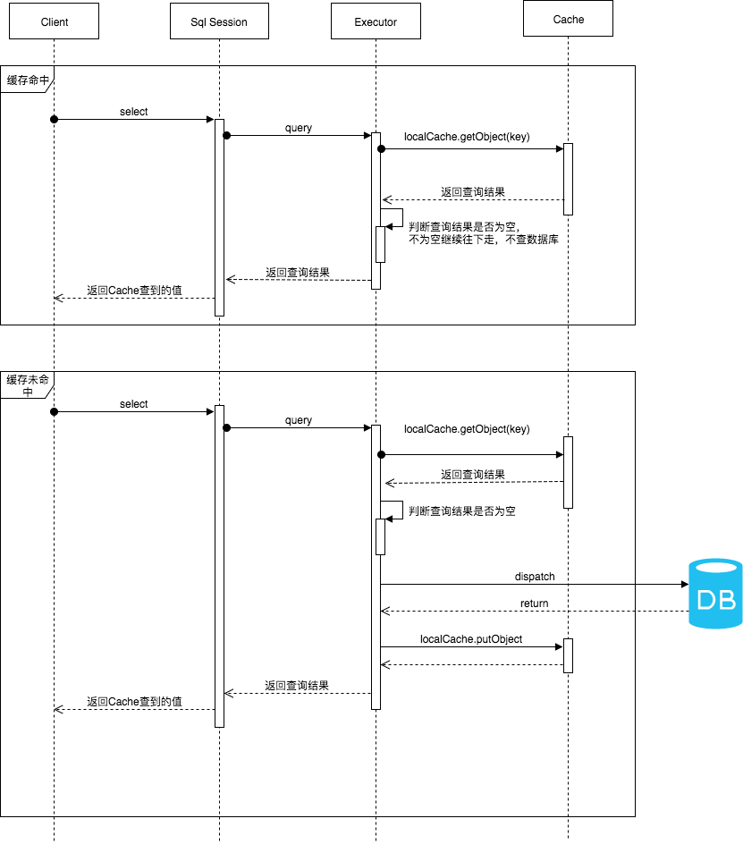

### Mybatis缓存机制梳理
> [学习来源](https://tech.meituan.com/2018/01/19/mybatis-cache.html) ``  
1. 一级缓存  
1.1. **一级缓存接收**  
  &nbsp;&nbsp;&nbsp;&nbsp;&nbsp;&nbsp;&nbsp;&nbsp;在应用运行过程中，我们有可能在一次数据库会话中，执行多次查询条件完全相同的SQL，MyBatis提供了一级缓存的方案优化这部分场景，如果是相同的SQL语句，会优先命中一级缓存，避免直接对数据库进行查询，提高性能。  
1.2. **一级缓存配置**  
``` xml
<!-- 共有两个选项，SESSION或者STATEMENT，默认是SESSION级别，即在一个MyBatis会话中执行的所有语句，都会共享这一个缓存。一种是STATEMENT级别，可以理解为缓存只对当前执行的这一个Statement有效。-->
<setting name="localCacheScope" value="SESSION"/>
```
1.3 **一级缓存流程示意图：**  
  
1.4. **一级缓存运行情况：**  
　　同一个sqlSession会话中，执行相同的sql，除了第一次外均会取缓存的数据，当执行更新时会删除缓存中对应的数据  
1.5. 一级缓存会取到脏数据的情况  
　　一级缓存的作用范围在一次sqlSession中，当一个sqlSession更改数据库的数据， 另外一个sqlSession读取已缓存的相同数据，就会读取没更改的缓存中的数据， 从而产生脏数据。  
1.6.  **总结：**  
> 1. MyBatis一级缓存的生命周期和SqlSession一致.  
> 2. MyBatis一级缓存内部设计简单，只是一个没有容量限定的HashMap，在缓存的功能性上有所欠缺。  
> 3. MyBatis的一级缓存最大范围是SqlSession内部，有多个SqlSession或者分布式的环境下，数据库写操作会引起脏数据，建议设定缓存级别为Statement。  
2. 二级缓存  
2.1. **二级缓存介绍**  
　　在上文中提到的一级缓存中，其最大的共享范围就是一个SqlSession内部，如果多个SqlSession之间需要共享缓存，则需要使用到二级缓存。开启二级缓存后，会使用CachingExecutor装饰Executor，进入一级缓存的查询流程前，先在CachingExecutor进行二级缓存的查询，具体的工作流程如下所示:  
  
2.2. **二级缓存配置**  
``` xml
<!-- 在MyBatis的配置文件中开启二级缓存。 -->
<setting name="cacheEnabled" value="true"/>

<!-- 在MyBatis的映射XML中配置cache或者 cache-ref 。
cache标签用于声明这个namespace使用二级缓存，并且可以自定义配置。 -->

<!-- 
  1. type：cache使用的类型，默认是PerpetualCache，这在一级缓存中提到过。  
  2. eviction： 定义回收的策略，常见的有FIFO，LRU。
flushInterval： 配置一定时间自动刷新缓存，单位是毫秒。
  3. size： 最多缓存对象的个数。
  4. readOnly： 是否只读，若配置可读写，则需要对应的实体类能够序列化。
  5. blocking： 若缓存中找不到对应的key，是否会一直blocking，直到有对应的数据进入缓存。
 -->
 <cache/> 

 <!-- cache-ref代表引用别的命名空间的Cache配置，两个命名空间的操作使用的是同一个Cache。 -->
 <cache-ref namespace="mapper.StudentMapper"/>
```  
2.3. **二级缓存运行情况说明:**  
* 只有提交事务之后才会, 二级缓存才会存储数据; 
* 执行更新语句后, 二级缓存会刷新; 再次执行查询语句, 才会重新存到缓存; 
* MyBatis的二级缓存不适应用于映射文件中存在多表查询的情况。会产生脏数据; 可以使用Cache ref，让ClassMapper引用StudenMapper命名空间，这样两个映射文件对应的SQL操作都使用的是同一块缓存了。但是这样会使缓存的粒度变粗, 多个mapper namespace 下的所有操作都会对缓存造成影响.   
2.4. **总结**
> MyBatis的二级缓存相对于一级缓存来说，实现了SqlSession之间缓存数据的共享，同时粒度更加的细，能够到namespace级别，通过Cache接口实现类不同的组合，对Cache的可控性也更强。  
MyBatis在多表查询时，极大可能会出现脏数据，有设计上的缺陷，安全使用二级缓存的条件比较苛刻。  
在分布式环境下，由于默认的MyBatis Cache实现都是基于本地的，分布式环境下必然会出现读取到脏数据，需要使用集中式缓存将MyBatis的Cache接口实现，有一定的开发成本，直接使用Redis、Memcached等分布式缓存可能成本更低，安全性也更高。


